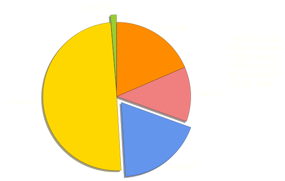

% IOOS Binstar Channel
% [Filipe Fernandes](https://github.com/ocefpaf), [Rich Signell](https://github.com/rsignell-usgs), and [Vembu Subramanian](https://github.com/vembus)
% Silver Springs, May 28th

---

# What is a Binstar Channel?

> - Binstar is a service that allows us to create and manage package repositories for conda
> - From their own webpage: "Package Everything!"
> - "And share your repositories with clients or colleagues."

# The IOOS Channel

> - 107 packages
> - Linux, Windows and OSX
> - Some really hard to compile like `iris`, `nco` and `gridgen`...
> - ...are now available via just `conda install -c ioos iris`


# How to use it?

```bash

conda config --add channels ioos

wget http://bit.ly/ioos_req -O ioos_req.txt

conda create --yes -n IOOS --file ioos_req.txt python=2.7

export PATH=$HOME/miniconda/bin:$PATH && source activate IOOS
```

. . .

That is it!


# IOOS requirements file

------- ---------- ----------------
iris    mpld3      pyoos
pandas  folium     rdflib
geojson requests   ipython-notebook
xlrd    mplleaflet oceans
qrcode  utilities
------- ---------- ----------------

# Downloads



# Packages per OS

## Linux and OSX: 107
## Windows: 90

# How we do it?

> - Conda recipes are hosted on GitHub
> - [AppVeyor](http://www.appveyor.com/) &#10139; Windows
> - [Travis-CI](https://travis-ci.org/) &#10139; OSX
> - [Centos docker container](https://registry.hub.docker.com/u/ocefpaf/centos64-conda-obvious-ci/) &#10139; Linux

# PRs


# Issues


# How to contribute?

> - Improve the [Wiki](https://github.com/ioos/conda-recipes/wiki)
> - Report problems in our [Issues page](https://github.com/ioos/conda-recipes/issues)
> - Requests packages
> - Pull Requests are even better ;-)

# Thanks!

### [https://binstar.org/ioos](https://binstar.org/ioos)


### Acknowledgements

*We would like to thank SECOORA for the funding support. We  would also like to thank the contributions of members of NOAA/IOOS, and Principal investigators.*
