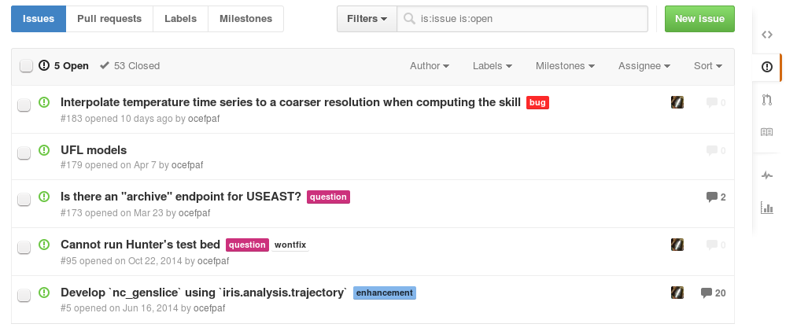

% Model Skill for SECOORA Ocean Models 
% [Filipe Fernandes](https://github.com/ocefpaf), [Rich Signell](https://github.com/rsignell-usgs), and [Vembu Subramanian](https://github.com/vembus)
% Silver Springs, May 27-29

## Exploiting IOOS: A Distributed, Standards-Based Framework and Open-Source Software Stack for Searching, Accessing, Analyzing and Visualizing Met-Ocean Data

# Why?

. . .

# and

. . .

## The right question is: Why not?

# Open development

[https://github.com/ioos/secoora](https://github.com/ioos/secoora)

# Ipython notebooks

# Obtaining the data

# Matching Observations and Models

# Displaying the results

# Quick demo

[http://ocefpaf.github.io/secoora/comparisons/timeSeries/ssh/](http://ocefpaf.github.io/secoora/comparisons/timeSeries/ssh/)

# The next version...

# ... featuring more visualizations too.

# Including HF-Radar

# Thanks!
 
### [http://ocefpaf.github.io/secoora](http://ocefpaf.github.io/secoora)

[http://www.phdcomics.com/comics.php?f=1687](http://www.phdcomics.com/comics.php?f=1687)

<!-- $$\mathit{MSE} = \frac{\sum_{t=1}^N {E_t^2}}{N}$$ -->
<!-- $$\mathit{SS} = 1- \frac{\mathit{MSE}_\text{forecast}}{\mathit{MSE}_\text{ref}}$$ -->

### Acknowledgements

*We would like to thank SECOORA for the funding support. We  would also like to thank the contributions of members of NOAA/IOOS, and Principal investigators.*